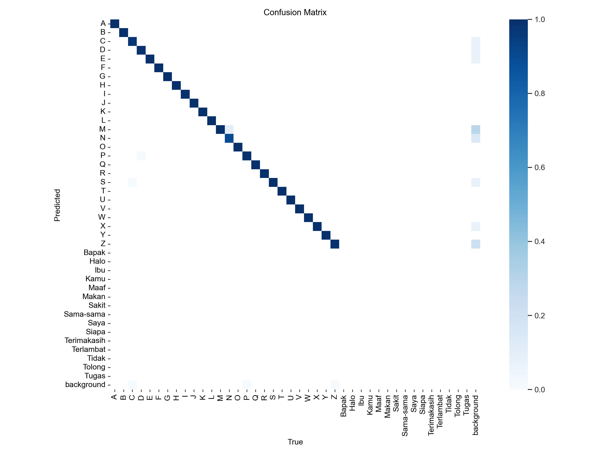
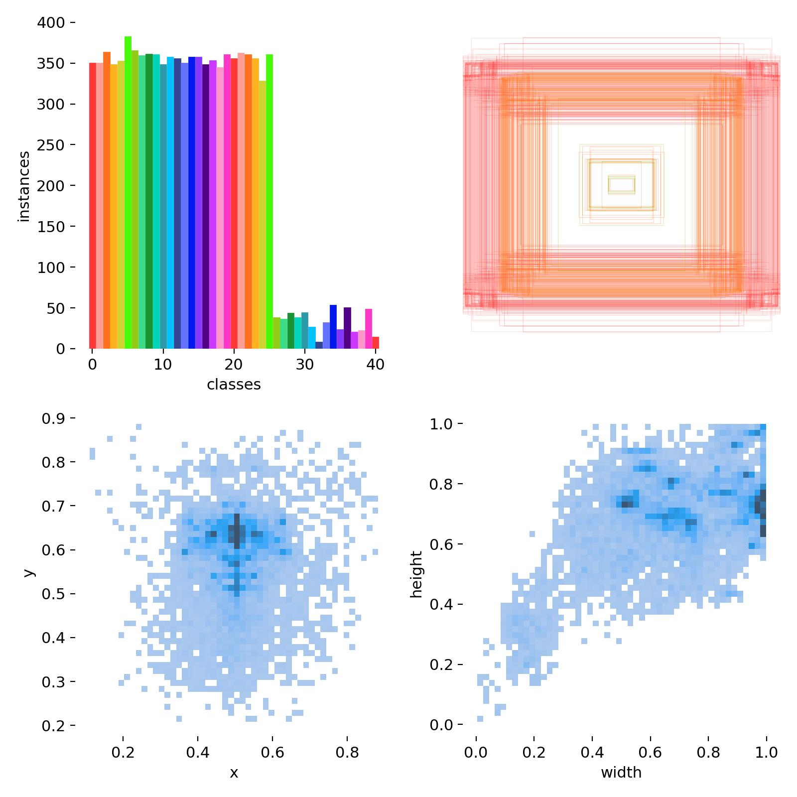

# Tugas untuk Kelas Kecerdasan Buatan UKDW

Anggota Kelompok :  
- Elisabeth Jesika Jerau – 71220899
- Hermanus Rangga Horo – 71220826
- Christopher Aaron - 71220881

## Sistem Penerjemah Bahasa Isyarat | Real-time detection.

Program ini adalah sistem kecerdasan buatan yang bisa menerjemahkan Bahasa Isyarat Indonesia (BISINDO). Model Dilatih Menggunakan Algoritma YOLOv5.
Program ini berkerja dengan cara mendeteksi melalui kamera secara real-time, yang akan langsung menampilkan Arti dari bahasa isyarat yang di terima dari kamera.
Model dilatih dengan 41 Macam class dengan masing-masing data yang berbeda.

## Daftar Isi
- [Syarat](#syarat)
- [Tutorial Instalasi](#tutorial-instalasi)
- [Penggunaan dengan Flask](#penggunaan-dengan-flask)
- [Penggunaan Tanpa GUI](#penggunaan-tanpa-gui)
- [Confusion Matrix Dan Visualisasi Data](#Confusion-Matrix-Dan-Visualisasi-Data)
- [Endpoint](#endpoint)
- [Contoh Mengontrol Kamera](#contoh-mengontrol-kamera)
- [Catatan Tambahan](#catatan-tambahan)
- [Kontribusi](#kontribusi)
- [Lisensi](#lisensi)
- [Sumber Data](#sumber-data)

## Syarat
- Python 3.6+
- Git
- PyTorch
- OpenCV
- Flask
- Device dengan Kamera

## Tutorial Instalasi
1. **Kloning repositori:**
    ```sh
    git clone https://github.com/dewaahr/Bisindo_AI.git
    cd Bisindo_AI
    ```

2. **Instal paket yang diperlukan:**
    - PyTorch:
        ```sh
        pip install torch
        ```

    - OpenCV:
        ```sh
        pip install opencv-python-headless
        ```

    - Flask:
        ```sh
        pip install Flask
        ```

3. **Unduh model YOLOv5:**
    Model YOLOv5 akan diunduh secara otomatis saat aplikasi dijalankan pertama kali. Pastikan Anda memiliki koneksi internet yang stabil.

## Penggunaan dengan Flask
1. Jalankan source code dengan perintah `python app.py`.
2. Buka browser dan buka alamat `http://127.0.0.1:5000/` untuk melihat hasil deteksi objek secara real-time.

## Penggunaan Tanpa GUI
1. Jalankan kode dengan perintah `python detect.py`.
2. Jendela video akan muncul dan menampilkan hasil deteksi objek secara real-time.
3.  `q` untuk menghentikan program.

## Confusion Matrix Dan Visualisasi Data
- Dengan 41 Class.
- Abjad A-Z, Beberapa Kata Dasar. <br>
  
  

## Endpoint
- **`POST /start_camera`**: Memulai webcam.
- **`POST /stop_camera`**: Menghentikan webcam.

## Contoh Mengontrol Kamera
- Memulai Kamera: 
    ```sh
    curl -X POST http://127.0.0.1:5000/start_camera
    ```
- Menghentikan Kamera:
    ```sh
    curl -X POST http://127.0.0.1:5000/stop_camera
    ```

## Catatan Tambahan
- Model Dilatih menggunakan YOLOv5. `https://github.com/ultralytics/yolov5`
- Deteksi dilakukan Secara real-time dengan mengakses kamera. Pastika Menjalankan Program dengan device yang memiliki kamera.
- Gunakan Model yang terbaru `bisndopt3.pt`
- Total Epoch = 120
## Sumber Data
- https://www.kaggle.com/datasets/achmadnoer/alfabet-bisindo
- https://www.kaggle.com/datasets/agungmrf/indonesian-sign-language-bisindo

